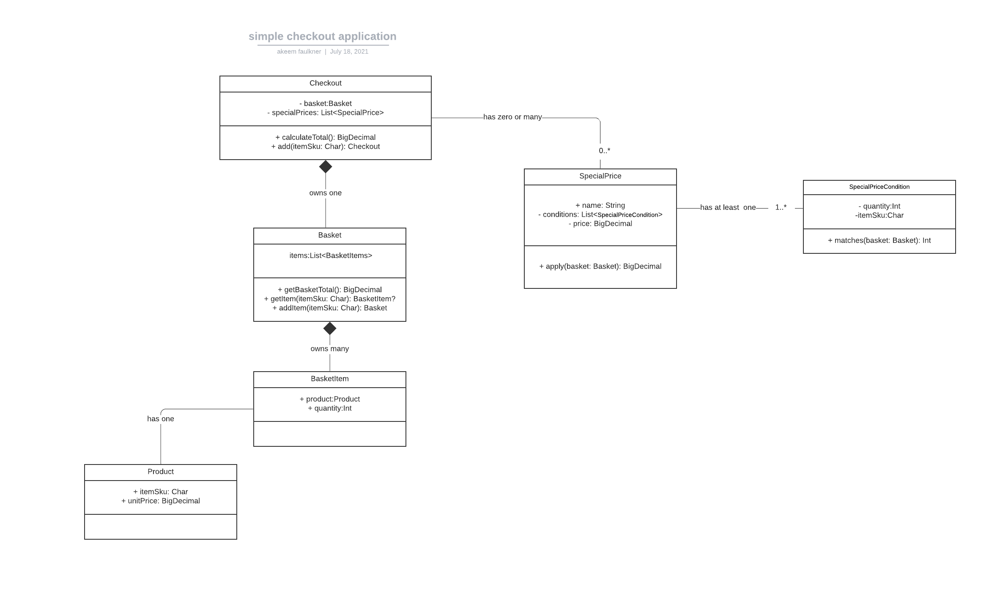

# simple-checkout-application

This is a simple checkout with support for special price calculations written in kotlin.

The high-level class relationships are depicted in the following uml:


The functionality for this application is covered in [unit tests](./src/test)
However, the [main.kt](./src/main/kotlin/main.kt) file prints to the `system out` to display the result of the rules.

## Running

This application was build with the gradle build tool

Requirements -

- Gradle: v6.8.2
- Java: 11
- Kotlin: 1.5.21

```shell
 # to run tests
 ./gradlew test
```

```shell
 # to run the application
 ./gradlew run
```